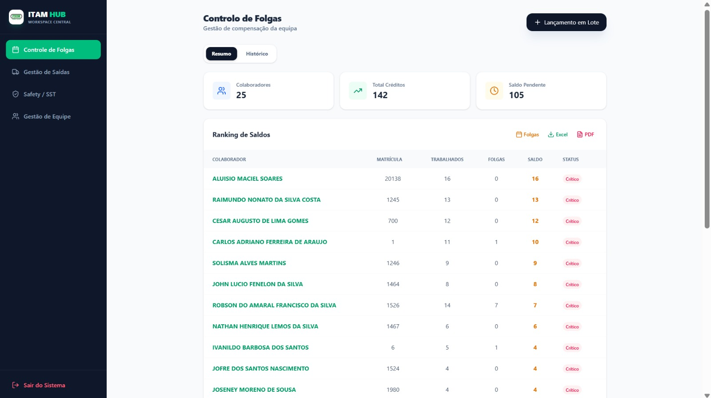
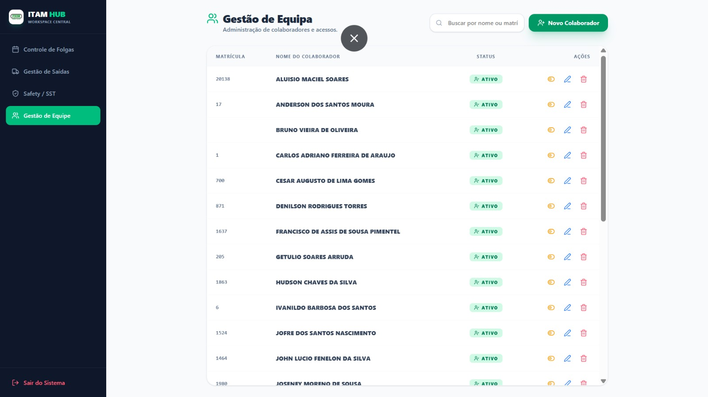
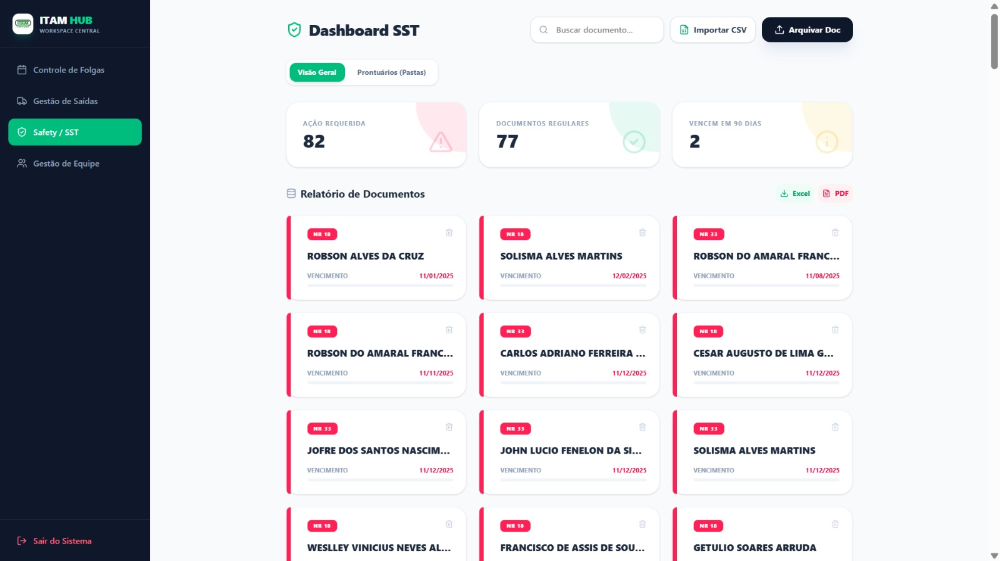
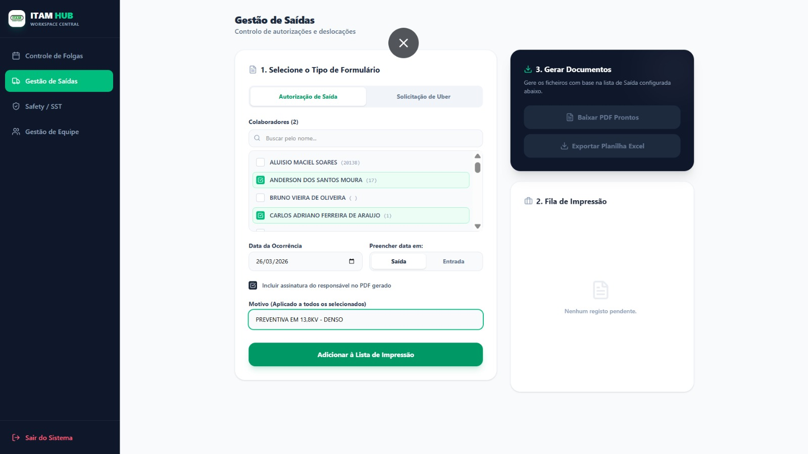

# 🛡️ SafetyOps Workspace


Um **ERP modular e escalável** para gestão de equipas técnicas, Segurança do Trabalho (SST), banco de horas e logística de frota.

> 🚀 Focado em produtividade, automação e centralização de operações de campo (Field Ops)

---

## 📸 Demonstração

> 💡 **Dica:** Substitua as imagens abaixo por prints reais do seu sistema

### Controle de Folgas



### Gestão de Equipe



### Módulo de Segurança (SST)



### Gestão de Saídas



---

## ✨ Funcionalidades

✔️ Gestão completa de colaboradores
✔️ Controle de banco de horas
✔️ Monitoramento de documentos SST (ASO, NR)
✔️ Alertas de vencimento (semáforo)
✔️ OCR com IA para leitura de documentos
✔️ Gestão de frota e deslocamentos
✔️ Exportação de relatórios (PDF/Excel)

---

## 🧩 Arquitetura

O projeto segue uma estrutura **monorepo**, separando frontend e backend:

```
safetyops-workspace/
├── backend/
├── frontend/
├── docs/
└── README.md
```

---

## 🚀 Tecnologias

### Frontend

- React + Vite
- TypeScript
- Tailwind CSS
- Lucide Icons

### Backend

- Node.js
- NestJS
- Prisma ORM

### Banco de Dados

- SQLite (dev)
- PostgreSQL (produção - planejado)

---

## ⚙️ Setup Local

### Pré-requisitos

- Node.js 18+
- NPM ou Yarn

---

### Instalação

```bash
git clone https://github.com/seu-usuario/safetyops-workspace.git
cd safetyops-workspace
npm run install:all
```

---

### Variáveis de Ambiente

#### Backend

```env
DATABASE_URL="file:./dev.db"
```

#### Frontend

```env
VITE_GEMINI_API_KEY="sua_chave_aqui"
```

---

### Banco de Dados

```bash
cd backend
npx prisma migrate dev --name init
cd ..
```

---

### Rodando o Projeto

```bash
npm run dev
```

---

## 🌐 Endpoints

- Frontend → http://localhost:5173
- API → http://localhost:3000
- Swagger → http://localhost:3000/api/docs

---

## 🧠 Diferenciais do Projeto

💡 Centralização de múltiplos processos operacionais
🤖 Uso de IA (OCR com Gemini)
📊 Foco em produtividade real de campo
🧱 Arquitetura escalável (NestJS + Prisma)
📁 Exportação e integração com ferramentas externas

---

## 🔒 Privacidade

Projeto voltado para fins educacionais e portfólio.

Todos os dados utilizados são fictícios, respeitando LGPD/GDPR.

---

## 📝 Licença

Este projeto está sob a licença MIT.

---

## 👨‍💻 Autor

Desenvolvido por **Mauro**
☕ + código + problemas reais = soluções eficientes
